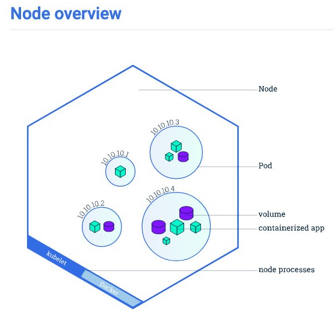

# Glossary

### Deployment

Deployments are described as a collection of resources and references. They are the central metaphor for what we would consider "apps" or "services".

### Node

A worker machine in Kubernetes; may be a VM or a physical machine, depending on the cluster. Each node contains the services necessary to run `pods` and is managed by the `master components`.

### Pod

The basic bulding block of Kubernetes. Represents a running process on your cluster; a single instance of an application in Kubernetes. Can consist of a single container or a small selection of tightly coupled containers. Docker is the most commonly used container runtime used in Kubernetes. Pods also represent shared resources for the containers:

* Shared storage, as `Volumes`
* Networking, as a unique cluster IP address
* Information about how to run each container, such as the container image version or specific ports to use.

### Service

Defines a logical set of `Pods` and a policy by which to access them - sometimes called a microservice. This allows a set of replica `Pods` to be accessible by other `Pods` without them needing to worry about which `Pod` they are accessing; therefore if any of the details of a pod change, for example the IP address of the API endpoint, then it won't break the functionality of the pods trying to access it.

### Kubelet

A process that is responsible for communication between the master and a `node`; it manages the `pods` and containers running on a node. A node must contain a kubelet.

### kubectl

A cli tool that allows us to communicate with our application through an API endpoint. See [Kubectl Commands](:/34391bb87ec24c15aab3a09adc222097) for more.

### Label

Labels can be used to group kubernetes objects. For example, we can list all pods that have a particular label, or we can assign a service to only deal with those pods.

### Minikube

A utility for easily running kubernetes on your machine. Runs a kubernetes cluster with 1 node in a VM.

